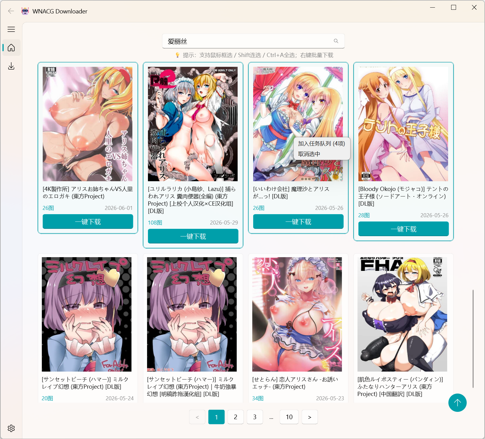
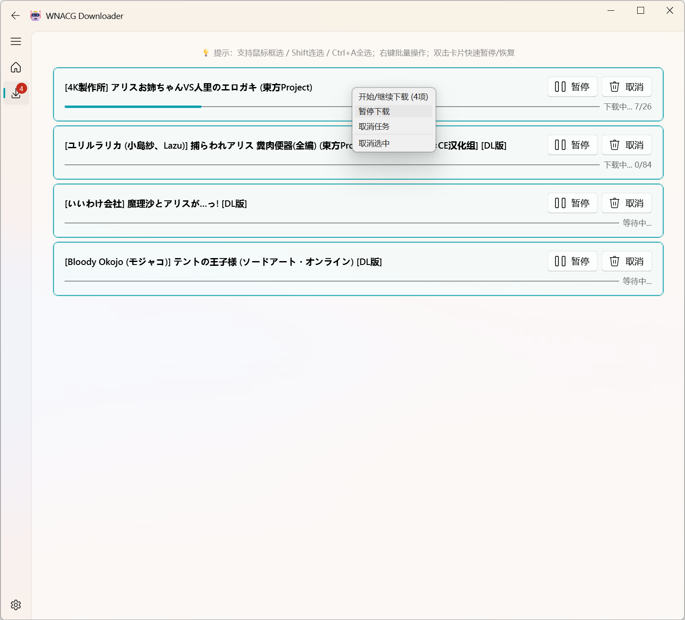
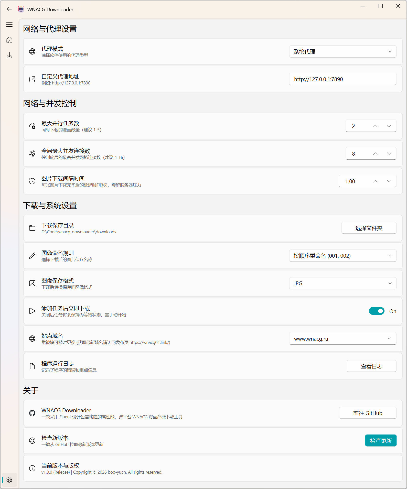

<div align="center">

# 🤖 WNACG Downloader (v1.0.0)

**可能是全网最精美、最强大的 WNACG 专属漫画极速下载器**


</div>

## 🎉 简介 (Introduction)

WNACG Downloader 是为了解决漫画爱好者“下载难、防屏蔽难、管理难”而诞生的全自动化看图神器。
我们拒绝简陋的黑框框命令行，也不需要复杂的环境配置。它不仅拥有一层**极其惊艳的亚克力 Fluent Design 外观**，在易用性上更是做到了**绝对的“傻瓜式直装”**。

你只需要解压，双击，然后享受满速下载的快感。

---

## ✨ 核心体验 (Why Choose Us?)

### 🎨 次世代精美 UI，Windows 11 风格大赏
基于顶级组件库 QFluentWidgets 重金打造。
- 充满现代感的**亚克力半透明背景**与**平滑动画**。
- 绝美的**自适应瀑布流卡片展示**，画廊级别的视觉享受。
- 丝滑的黑夜/白天模式自动切换，深夜看图更护眼。

### 🚀 真正的“纯小白解压即用”
不用懂代码，不用配环境！
所有的底层逻辑（防撕裂、高并发、智能回退）都已经为您打包装箱。我们在云端为您编译了极为纯净的 .exe 单文件。
- **一键极速热更新**：想升级？在设置里点击“检查更新”按钮。程序内置了国内免翻墙公益镜像源（如 kkgithub），完全无需代理也能瞬间拉取最新版本！

### 🖱️ 极其顺手的高效交互
- **快捷键加持**：支持 鼠标框选、Shift 连选、Ctrl+A 全选。
- **一键操作**：在下载任务列表中，直接双击卡片中心即可快速触发“暂停 / 恢复”任务，操作犹如行云流水。

---

## 📸 界面预览 (Screenshots)

### 瀑布流画廊与搜索页


### 高速下载队列与批量操作


### 沉浸式高级设置面板


---

## 📦 极速上手 (Quick Start)

### 选项一：普通玩家 (推荐，免环境直装版)
1. 前往右侧的 [Releases 页面](../../releases/latest)。
2. 下载 WNACG-Downloader-Windows.zip。
3. 解压并直接双击运行 WNACG-Downloader.exe 即可畅快使用！

### 选项二：极客玩家 (源码运行)
推荐使用现代化的 Python 包管理器 [uv](https://github.com/astral-sh/uv) 来运行本项目，以获得极速的依赖解析体验。

```bash
# 1. 克隆代码仓库
git clone https://github.com/boo-yuan/wnacg-downloader.git
cd wnacg-downloader

# 2. 极速安装并运行
uv run src/main.py
```

---

## 💡 幕后的硬核“黑科技”

虽然外表精致，但这台引擎内部搭载了工业级的发电机：
*   **全局发牌器 (Global Token Bucket)**：彻底瓦解高级 WAF，你的每一次下载都会像人类一样带有极轻微的随机延迟交错，告别机器特征，彻底防封禁。
*   **深潜防撕裂 (Deep Validation)**：每一张图片落地后都会进行 EOF 字节流探伤。哪怕遇到网络闪断导致的半截图，也会被立刻揪出回炉重造，保障每一张老婆都 100% 完整无缺！
*   **多域智能回退 (Multi-Domain Fallback)**：域名被墙？DNS 被污染？无所谓。核心引擎会无感、静默地自动切换备用节点（.org, .net, .com）继续重试。
*   **SQLite 并发重构**：解锁了底层读写死锁。无论底层下载协程如何狂暴读写，UI 层永远维持毫秒级的高刷响应！

## 📄 开源协议 (License)
本项目遵循 MIT 开源协议。详情请参阅 [LICENSE](LICENSE) 文件。
