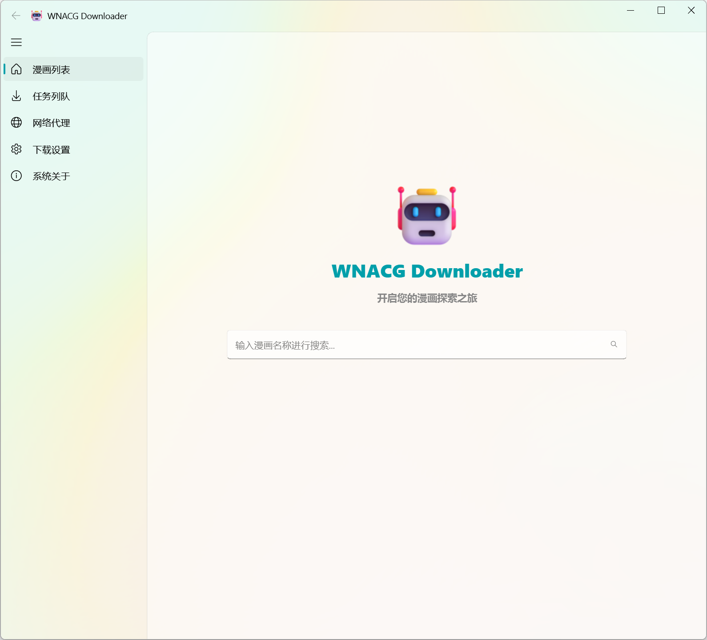
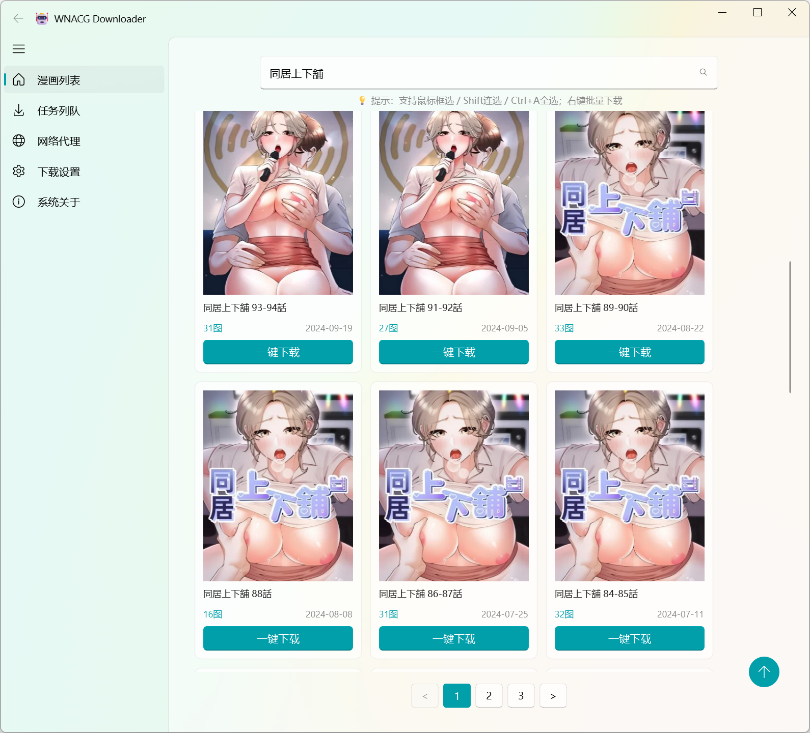
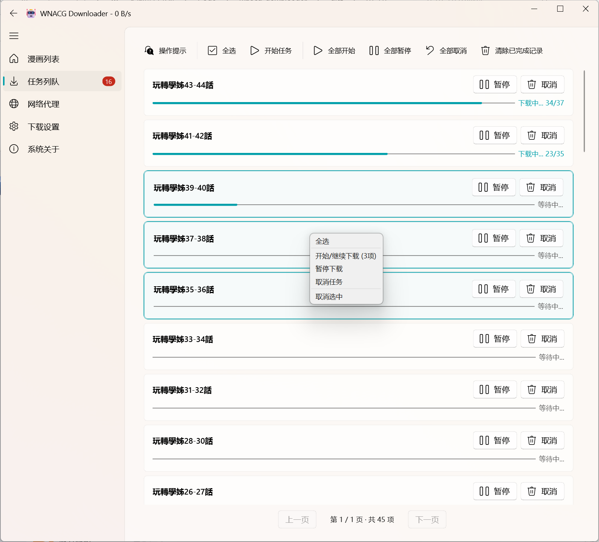
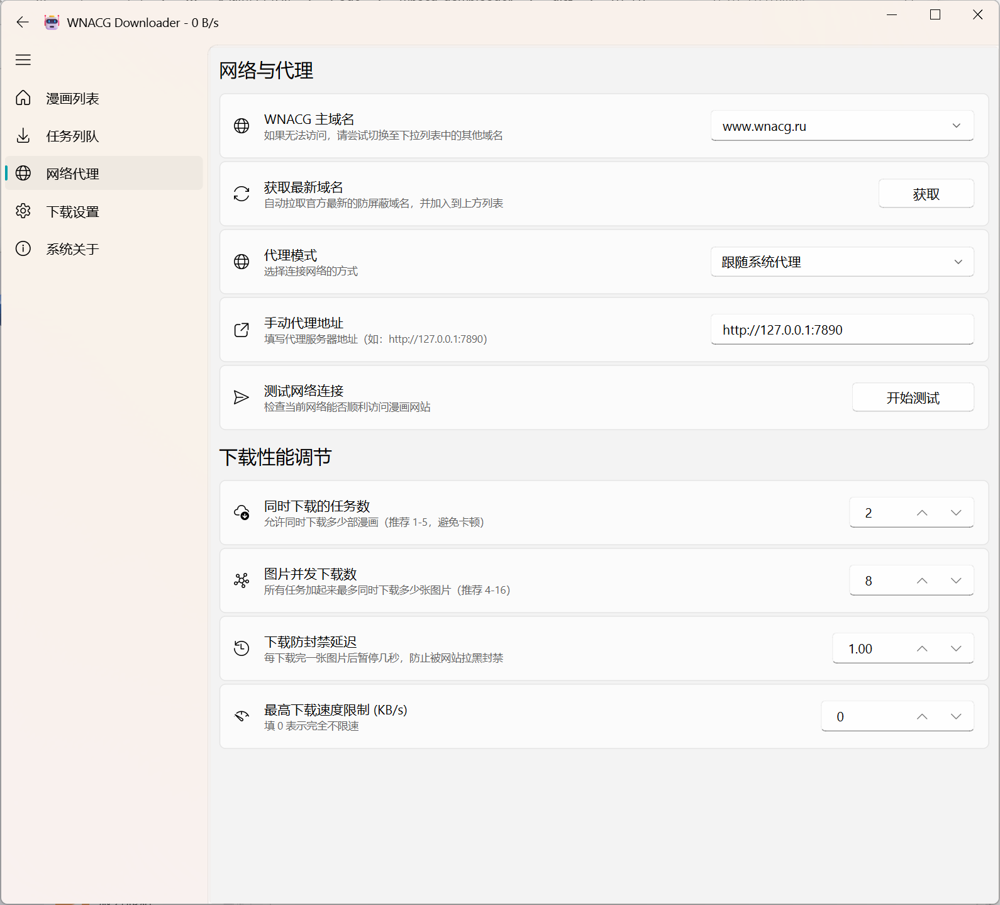
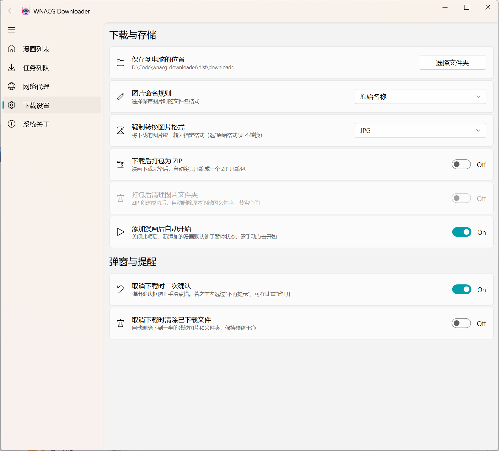
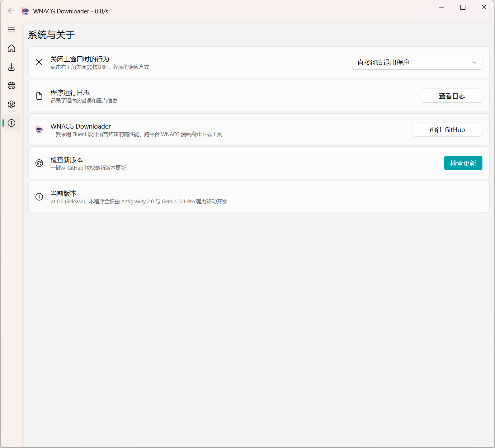

# WNACG Downloader

基于 PySide6 的 Windows 桌面画廊下载管理器。程序支持搜索与画廊 URL 解析、可恢复任务、批量控制、代理、全局并发与限速、图片格式转换，以及经过校验的原子 ZIP 打包。

当前最新版本：`1.2.0`

运行环境：Python 3.12 或 3.13（预编译 EXE 不需要安装 Python）

## 功能

- 支持关键词、`aid:编号` 和完整画廊 URL。
- 多任务并发下载，支持暂停、恢复、失败重试和启动后进度恢复。
- 支持原文件、JPG、PNG、WebP 输出，以及原始名称或顺序编号。
- 可选择打包为 ZIP；归档通过完整性检查后才替换最终文件。
- 支持系统代理、直连和自定义 HTTP(S)/SOCKS 代理。
- 支持全局连接数、任务并发数、请求间隔和下载速度限制。
- 支持系统托盘、完成通知、批量选择和打开下载目录。
- 完成记录对应文件丢失时会标记为 `MISSING`，可重新下载。

## 界面预览

<table>
  <tr>
    <td width="50%" align="center"></td>
    <td width="50%" align="center"></td>
  </tr>
  <tr>
    <td width="50%" align="center"></td>
    <td width="50%" align="center"></td>
  </tr>
  <tr>
    <td width="50%" align="center"></td>
    <td width="50%" align="center"></td>
  </tr>
</table>

## 安装与运行

### 使用 Windows 单文件程序

从 [Releases](../../releases/latest) 下载 `WNACG-Downloader.exe` 后直接运行。首次启动会在用户应用数据目录创建配置、任务数据库、日志和封面缓存；默认下载目录为 `%USERPROFILE%\Downloads\wnacg`，可在设置中修改。

### 从源码运行

需要 Windows、Python 3.12 或 3.13，以及 [uv](https://docs.astral.sh/uv/)。项目只使用 `pyproject.toml` 和 `uv.lock` 管理依赖。

```powershell
git clone https://github.com/boo-yuan/wnacg-downloader.git
cd wnacg-downloader
uv sync --locked
uv run --locked python -m wnacg
```

也可以执行 `run.bat`，脚本会按照锁文件同步运行时依赖后启动应用。

## 数据位置与环境覆盖

Windows 默认数据目录为：

```text
%LOCALAPPDATA%\wnacg-downloader
```

其中包含 `config.json`、SQLite 任务库、JSON Lines 日志和缓存。测试或便携场景可通过 `WNACG_DATA_DIR` 覆盖数据目录。其他 `WNACG_` 前缀的配置环境变量会在运行时优先于配置文件，但不会意外覆盖已持久化的用户值。

## 安全与数据完整性

- 所有 HTTP 请求保持 TLS 证书验证；直连模式还会校验 DNS 结果、重定向地址和实际连接对端，阻止访问本机或私网地址。
- 更新功能只读取 GitHub 官方发布元数据并打开官方发布页，不会自动下载或执行程序。
- HTML、封面、单图、画廊图片数、分页数、整本字节数和图片解码像素均设有硬上限，并在写入时持续检查磁盘余量。
- 图片先写入临时文件，经内容类型、完整解码和像素预算检查后再原子替换。
- 下载目录使用“标题 `[aid]`”命名，避免同名画廊互相覆盖。
- 文件清单只记录程序拥有的文件。打包、重下和取消清理不会处理用户自行放入任务目录的普通文件。
- 删除前会重新验证下载根目录、任务直属目录、符号链接和 Windows junction，降低路径伪造或误删风险。

这些保护用于降低风险，但不能保证目标站点始终可用，也不能保证任何使用方式不会触发网站的访问限制。请合理设置并发和请求间隔，并遵守目标站点规则及所在地法律。

## 开发与验证

```powershell
uv sync --locked --group dev
uv run --locked ruff check .
uv run --locked ruff format --check .
uv run --locked pyright
uv run --locked pytest --cov --cov-report=term-missing
uv run --locked python -m wnacg --smoke-test
uv audit --locked --no-dev
```

当前门禁覆盖整个 `wnacg` 包（包括入口和 Qt UI），要求分支覆盖率不低于 55%。当前回归集为 75 项测试，最近一次全包分支覆盖率约 57%。CI 在 Python 3.12 和 3.13 上执行 Ruff、严格 Pyright、pytest 与源码烟雾测试，并单独执行依赖审计和 CycloneDX SBOM 导出验证。CI 不构建或发布 EXE。

本地构建：

```powershell
.\build.bat
```

成功后生成 `dist\WNACG-Downloader.exe`。

EXE 只在本地手动构建。发布前应运行生成程序的烟雾测试并计算 SHA-256：

```powershell
$process = Start-Process -FilePath .\dist\WNACG-Downloader.exe -ArgumentList --smoke-test -Wait -PassThru
if ($process.ExitCode -ne 0) { exit $process.ExitCode }
Get-FileHash -Algorithm SHA256 .\dist\WNACG-Downloader.exe
```

## 架构边界

- `domain`：领域模型、状态机和不可变任务选项。
- `application`：下载编排、安全路径、资源限额、文件事务和持久化端口。
- `infrastructure`：SQLite、HTTP、配置、日志和更新检查适配器。
- `ui`：Qt 界面及平台集成，通过构造参数接收下载器和仓储端口。

入口是唯一组合根：单实例锁成功后显式初始化路径、日志、配置和数据库，再构造下载器并注入 UI。导入模块不会迁移数据库或启动下载线程。

## 版本记录

### v1.2.0

本版本在 `v1.1.0` 基础上完成多轮深度审查，重点提升恢复能力、并发一致性、网络与文件安全，以及发布流程的可验证性。

- 将单实例锁提前到配置、数据库、下载器和 UI 初始化之前，重复启动不会改写活动任务状态。
- 使用事务、条件更新和任务级聚合锁保护任务领取、状态迁移及并发进度持久化。
- 下载任务持久化不可变选项快照；配置环境变量在运行时优先，但不会意外覆盖用户保存值。
- 完成文件丢失时标记为 `MISSING` 并允许重新下载；完成任务不再进入取消状态。
- 直连请求校验 URL、DNS、重定向和实际连接对端 IP，更新检查仅接受 GitHub 官方元数据与发布页。
- 为 HTML、封面、单图、图片数、分页数、整本字节数、解码像素和磁盘余量设置硬上限。
- 图片经过内容类型、完整解码和像素预算检查后原子替换，转换后的实际大小计入整本预算。
- 直链解析失败或数量不符时回退到有界分页抓取，缺页或最终数量不符不会误报完成。
- 使用文件清单记录程序拥有的产物；打包、重下与取消清理不会处理用户自行放入任务目录的普通文件。
- 删除前验证持久化根目录、直属任务目录、符号链接和 Windows junction；ZIP 校验完整后才替换最终归档。
- 隔离损坏数据库记录，逐字段恢复损坏配置并保留备份，旧数据采用非破坏方式迁移。
- 下载器、封面管理器和 UI worker 使用统一退出期限，事件循环关闭前排空异步任务和线程执行器。
- UI 使用 generation token 丢弃过期搜索与卡片结果，删除操作按后端实际结果更新界面。
- 重构为 `domain`、`application`、`infrastructure`、`ui` 分层，并从入口显式注入仓储与下载服务。
- 建立 Ruff、严格 Pyright、75 项 pytest 回归测试、全包分支覆盖率门槛、源码烟雾测试、依赖审计和 SBOM 验证；EXE 构建与烟雾测试由发布者在本地执行。

### v1.1.0

第二个公开版本，重点优化下载队列调度和长时间运行时的资源回收，修复画廊页面转义内容导致的图片数量解析问题，并完善完成通知、暂停提示、双击打开下载位置、右键菜单和设置界面联动等交互体验。

### v1.0.0

首个公开稳定版本，提供 Windows 单文件程序、图形化搜索与下载队列、暂停/恢复、系统托盘、完成通知、代理、并发与速度限制、图片转换和 ZIP 打包等基础能力，并建立 SQLite 任务持久化与日志轮转机制。

完整的审查与整改映射见 [docs/issue-remediation.md](docs/issue-remediation.md)。

## 免责声明

本项目仅用于个人学习与技术研究。使用者应遵守目标站点条款、版权规定及所在地法律法规，不得将本程序用于侵权、商业滥用或其他非法用途。因使用本项目产生的风险和责任由使用者自行承担。

## 许可证

[MIT License](LICENSE)
